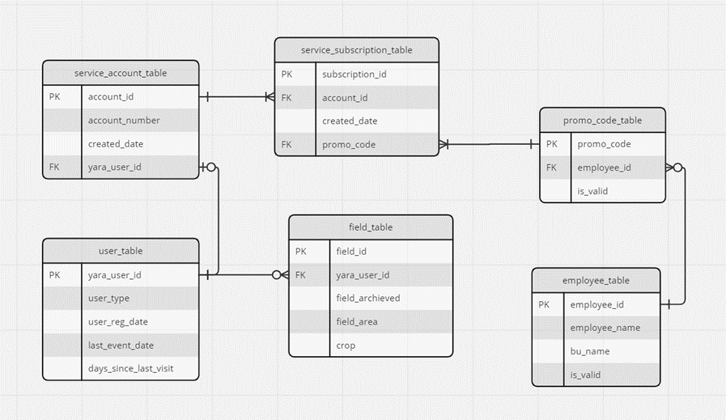

# Case Yara

## AgTech Use Case
Disclaimer: this case is based on a made-up dataset that mimics challenges faced by data analysts at Yara.

Challenge: the candidate is assigned the tasks below and shall return:
• Code sheet (i.e., SQL, python, python Notebook, R, etc.);
• This file with answers to tasks 1 and 2;
• A single presentation deck for tasks 3 and 4, focused on a business audience.

The Digital Innovation organization at Yara has developed a digital application that goes to farmers’ hands and support them in the process of taking decisions on how to best apply fertilizers and when. They contribute to an efficient use of fertilizers and therefore can impact on crop yield, return on investment, while also driving a nature-positive outcome.

The success of Yara’s app is measured against the following KPIs:
• Active users: users that have used the app at least once in the last 12-rolling months. If last event is earlier than that, the user is considered to have churned.
• Active fields: non-archived fields belonging to active users.
• Active hectares: field area belonging to active fields.

Recently, a loyalty program was created, and, among others, it encourages farmers to use the app extensively to draw the boundaries of their fields, explore the created fields (use the app to view created fields and configure them), monitor them (seeing climate, satellite images, etc.), create fertilizer application maps, and crop nutrition recommendations. To become a member, the farmers receive vouchers from Yara’s commercial units, which also allows for measuring the engagement of those units.

### Tasks

1) Before beginning any type of analysis, usually it is necessary to create a SQL query to build a dataset. Using the tables from the schema file, create a query that returns the following columns:

- User id (yara_user_id);
- Business unit (bu_name);
- Employee (employee_name);
- Promo-code (promo_code);
- Date of registration (user_reg_date);
- Total number of fields;
- Total number of active fields;
- Total field area;
- Total active field area.

Important: The resulting dataset should have only one row per user.

#### Schema details: 
 
Figure 1: Schema details

- **user_table**: Each row represents a user, with a unique identifier (yara_user_id). 
- **field_table**: Each row represents a field, each field is related to one user, but a user can have multiple fields.
- **promo_code_table**: Each row represents a promo-code (each promo-code is unique) that loyalty program users need to register in the app.
- **employee_table**: Each row represents an employee (salesperson). It contains information about the BU the employee is allocated.
- **service_account_table**: This table is from a service that Yara uses to generate promo-codes to promote the usage of our tools, here the details from the account of this service are located. Each row represents an account that is used to generate the promo-codes. Unique account identifier is the account_id.
- **service_subscription_table**: The same service provides a subscription of each account to certain programs, in this table the promo-codes to each of such initiatives are stored. Each row represents a subscription from a user. The account_id field specifies the account associated with that subscription.

2)	Using the dataset provided, answer the following questions:

- How many days are there between the registration and last event from users in CC-BGX, CC-GUI and CC-PAM?  
- Please provide the values for the three previously explained KPIs, segmented by user_type. The reported values should include the metric in absolute value and it’s percentual contribution (e.g., 100 ha / 32%).

3)	The VP of Commercial Excellence Americas, the loyalty program’s sponsor, requested the analytics team to evaluate the program’s success by comparing loyalty to non-loyalty farmers. Are loyalty users different from regular users in relation to the main KPIs, app utilization and churn? Another important aspect is to understand if there are any BUs being more successful in acquiring and maintaining users in our digital tools. Create a 10-15 min presentation, bearing in mind she is not familiarized with technical data analysis terms. Please feel free to suggest data driven action plans. 

4)	Build a user churn prediction model and propose an action plan to prevent them from becoming inactive. Create a 5-10 min presentation.
